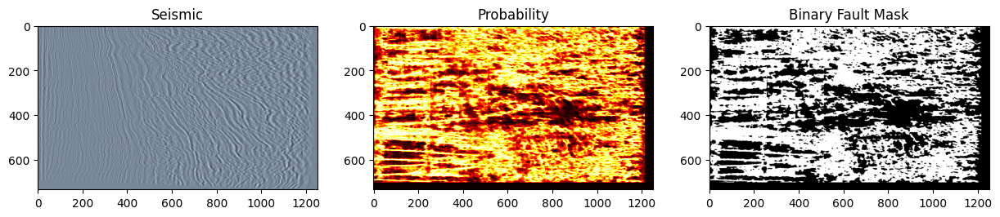
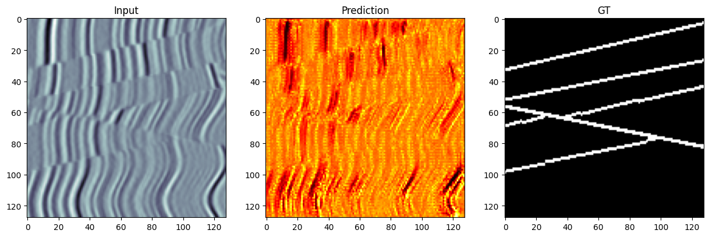
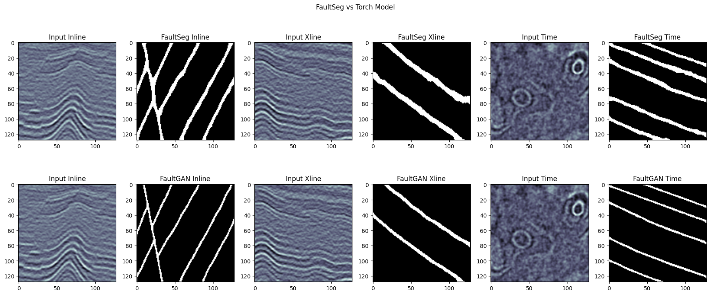
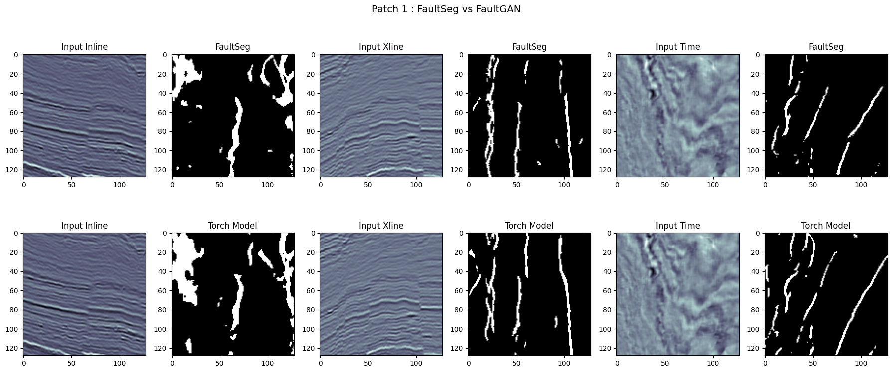
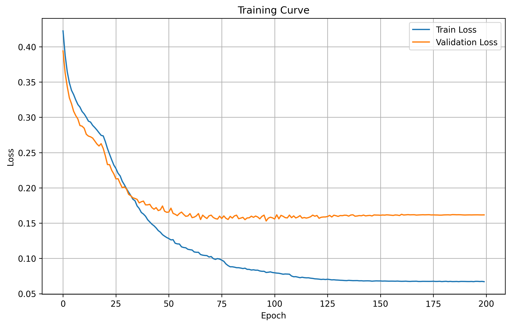
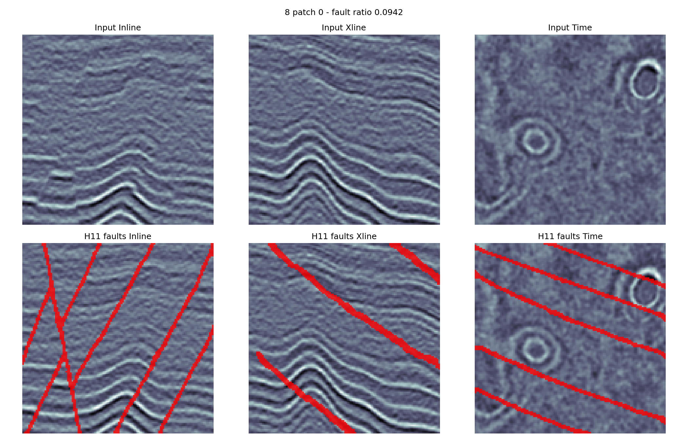
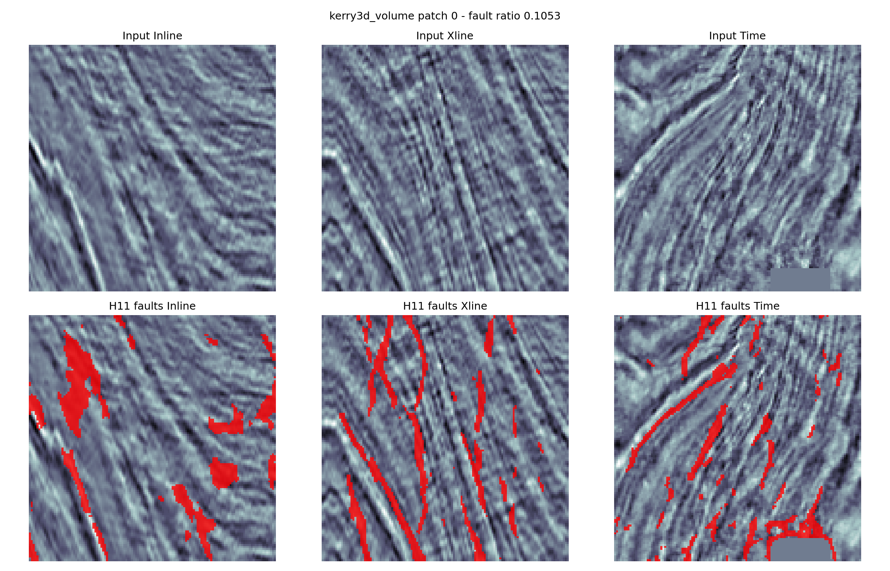

# SSL

**Self-supervised pretraining for 3D seismic fault segmentation.**

Labelled fault picks are scarce and expensive, while raw 3D seismic data is comparatively abundant. This project investigates whether a masked-autoencoder-style self-supervised objective — reconstructing masked cubes of an unlabelled seismic volume — can learn representations that transfer to fault segmentation with less reliance on synthetic training labels, and how the resulting model compares against established supervised baselines.

> **Publication status:** A manuscript describing this work is currently under review.

## Approach

1. **Self-supervised pretraining (MAE-style).** A 3D residual encoder-decoder (`src/mae_ssl_fault_segmentation.py`) is trained to reconstruct randomly masked sub-volumes of unlabelled seismic cubes (Kerry-3D, F3), learning general seismic feature representations without any fault labels.
2. **Fine-tuning for fault segmentation.** The pretrained encoder is transplanted into a U-Net-style segmentation head (`FaultSegModel`) and fine-tuned on labelled fault patches — first with the encoder frozen, then jointly at a lower learning rate — supervised with a combined BCE + Dice loss.
3. **Baseline comparison.** The self-supervised pipeline is benchmarked against two supervised baselines trained from scratch: a simplified 3D U-Net in the style of Wu et al.'s FaultSeg3D (`src/legacy_unet3d.py`, `configs/legacy_unet3d_architecture.json`) and a GAN-based fault segmentation model. Qualitative and patch-level comparisons between all three are explored in `notebooks/04_model_comparison_faultseg_vs_faultgan.ipynb`.

## Results

All figures below are saved outputs from the project notebooks and the trained H11 model package, not re-rendered or synthesized for this README.

**Fine-tuned model prediction on a volume slice.** Seismic slice, predicted fault probability, and thresholded binary fault mask from the self-supervised fine-tuned model (`notebooks/03_mae_ssl_pretraining_and_inference.ipynb`):



**Prediction vs. ground truth.** Input patch, model prediction, and ground-truth fault labels:



**Baseline comparison on synthetic data.** FaultSeg and FaultGAN predictions on synthetic patch 8 (`notebooks/04_model_comparison_faultseg_vs_faultgan.ipynb`):



**Baseline comparison on field data.** FaultSeg (top) vs. the Torch model (bottom) on field patch 1:



**Training curve.** Train and validation loss over 200 fine-tuning epochs for the H11 model. Validation loss flattens at roughly 0.16 from about epoch 75 onward while training loss continues to fall to about 0.07, a widening gap that points to overfitting on the synthetic training patches:



**H11 predictions on synthetic and field patches.** On a synthetic patch the model predicts clean, continuous fault planes. On a Kerry-3D field patch the predictions follow the main fault trends but are fragmented and noisier, reflecting a synthetic-to-field domain gap:

| Synthetic patch 8 | Kerry-3D patch 0 |
|---|---|
|  |  |

## Repository structure

```
SSL/
├── results/                                       # figures saved from notebook outputs
├── notebooks/
│   ├── 01_kerry3d_data_exploration.ipynb          # SEG-Y loading, header scanning, 3D visualization
│   ├── 02_segy_dataset_inspection.ipynb           # dataset sanity checks, sub-cube extraction
│   ├── 03_mae_ssl_pretraining_and_inference.ipynb # SSL pretraining loop + fault inference
│   └── 04_model_comparison_faultseg_vs_faultgan.ipynb
├── src/
│   ├── mae_ssl_fault_segmentation.py   # residual 3D encoder/decoder, MAE pretraining, fault fine-tuning
│   └── legacy_unet3d.py                # simplified 3D U-Net baseline (FaultSeg3D-style)
├── configs/
│   └── legacy_unet3d_architecture.json # exported Keras architecture for the legacy baseline
├── requirements.txt
└── LICENSE
```

## Data

- **Kerry-3D** (New Zealand, Taranaki Basin) — public-domain SEG-Y volume, [source](http://s3.amazonaws.com/open.source.geoscience/open_data/newzealand/Taranaiki_Basin/Keri_3D/Kerry3D.segy).
- **F3** (Netherlands offshore, North Sea) — public demo seismic volume, commonly used for fault/facies benchmarking.
- Synthetic fault-labelled training/validation patches, used for supervised fine-tuning and baseline training.

Raw seismic volumes, derived NumPy/`.dat` patches, and trained model weights (`.pt`/`.pth`/`.hdf5`) are **not included** in this repository due to size — see `.gitignore`. Notebooks reference these under a sibling `../data/` directory; update the paths to point at your own copies to reproduce the pipeline end to end.

## Running

```bash
pip install -r requirements.txt
jupyter lab notebooks/
```

`src/legacy_unet3d.py` is kept for reference as a historical TF1/Keras-era baseline and requires an older `tensorflow`/`keras` environment (see comments in `requirements.txt`); it is not needed to run the self-supervised pipeline in `src/mae_ssl_fault_segmentation.py`, which is pure PyTorch.

## License

Released under the terms of the [LICENSE](LICENSE) file in this repository.
